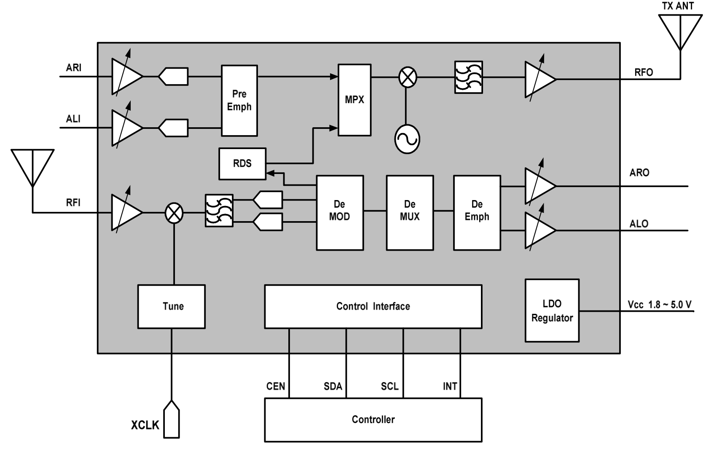
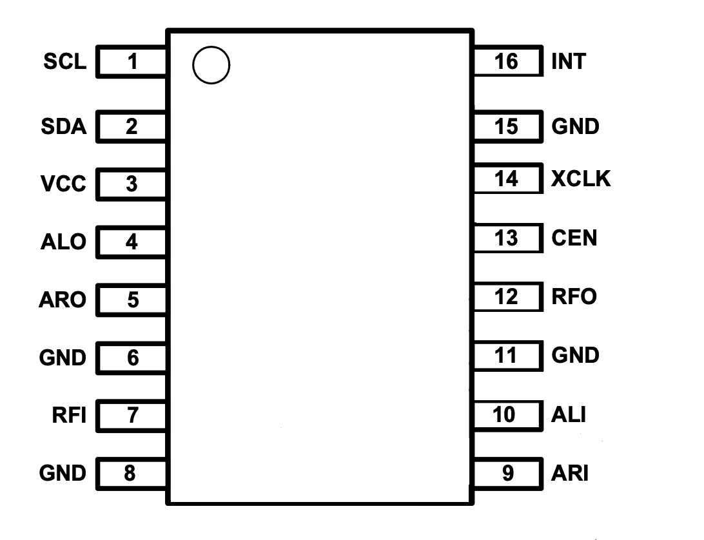
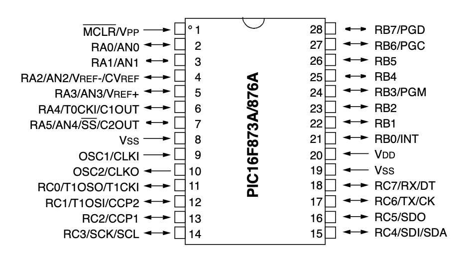
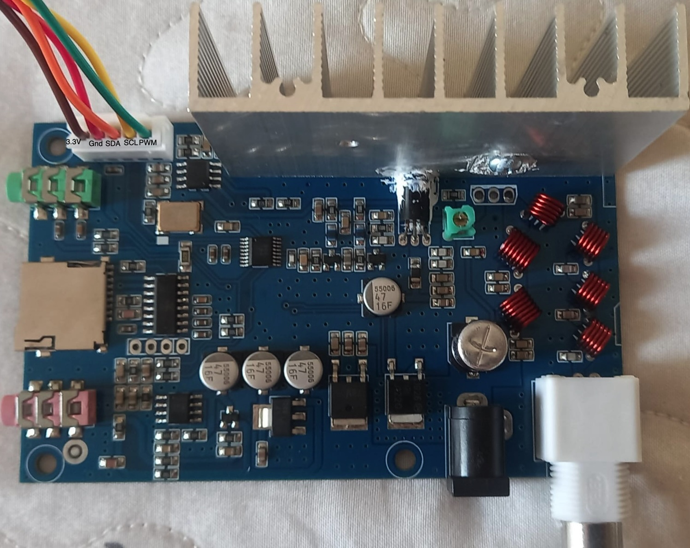
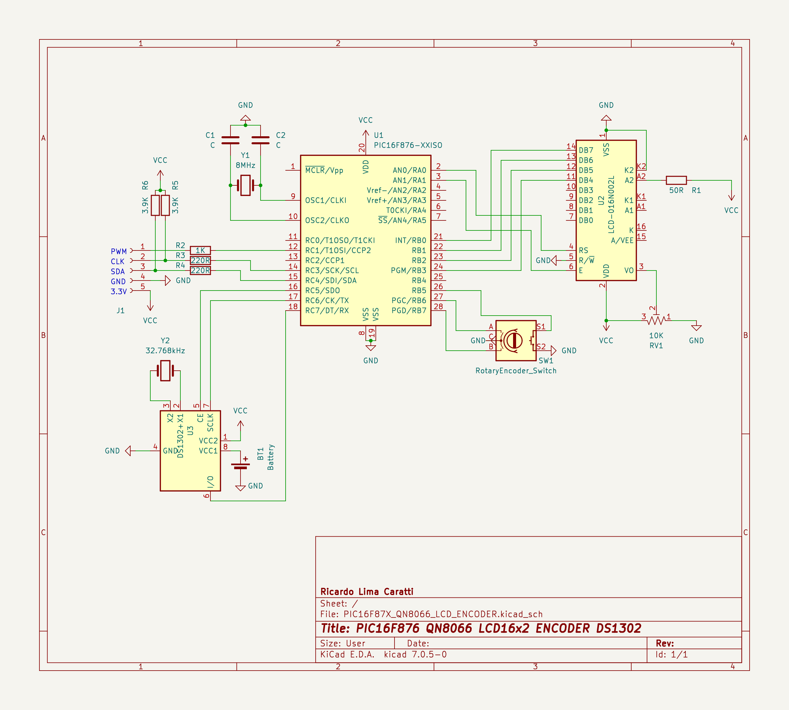

# QN8066 FM TRANSMITTER WITH PIC16F876A

This projeto is intended to provide an easy-to-use interface for controlling the QN8066 FM transceiver using the PIC16F876A.

The primary goal of this project for the QN8066 is to simplify the development of robust applications using this device. I hope that hobbyists, electronics technicians, radio amateurs, and others interested in this work will find success in their projects. 

This project can be freely distributed using the MIT Free Software model. 
By using or installing Library you are agreeing to the terms of the MIT licence.

Copyright (c) 2024 Ricardo Lima Caratti.

Contact: pu2clr@gmail.com.

THIS PROJECT IS UNDER CONSTRUCTION...

## QN8066 Functional Blocks

1. RF Front-End: The RF front-end is designed to efficiently capture and process FM signals, ensuring minimal loss and high-quality signal reception.
2. PLL Synthesizer: The phase-locked loop (PLL) synthesizer ensures stable frequency generation and accurate tuning.
3. Audio Processing: Includes both analog and digital audio processing units to enhance sound quality and support various audio formats.
4. Power Management: Advanced power management features optimize power consumption, making the QN8066 ideal for portable applications.

### Attention

The Logic signals level of the QN8066 device (CEN, SCL, SDA, to GND) works from 1.6V to 3.6V (see Datasheet, ELECTRICAL SPECIFICATIONS, section Recommended Operating Conditions). If you are using a 5V microcontroller board, it is possible you are sending  5V signals to the QN8066 device through the digital pins and the I2C bus. That configuration can make the system unstable or damage the QN8066 device. To fix this, use a logic shifter chip that converts between 3.3V and 5V logic.

## QN8066 PINOUT

## PIC16F876A PINOUT 

## KIT DIY QN8066 FM TRANSMITTER

## CONTROLLER SCHEMATIC BASED ON PIC16F876A

The following schematic presents a proposed controller for the QN8066 based on the PIC16F876. A 16x2 LCD is used for the visual interface, but the program can be easily adjusted to work with a 20x4 LCD. Optionally, you may include a clock based on the DS1302. This device will be useful for transmitting Date and Time services via FM RDS. Finally, a rotary encoder is used to navigate through a menu of options to configure the transmitter.

Still regarding the previously presented schematic, observe the interface used for connecting to the QN8066 module, which could either be the DIY KIT previously mentioned or another module. Note that there is a PWM output to control the FM transmitter power, as suggested by the DIY KIT. However, the PWM interface can be removed if you choose another type of power control.

## References

* [PIC16F87XA Data Sheet - 28/40/44-Pin Enhanced Flash Microcontrollers](https://ww1.microchip.com/downloads/en/devicedoc/39582b.pdf)
* [I2C Communication with PIC Microcontroller PIC16F877](https://circuitdigest.com/microcontroller-projects/i2c-communication-with-pic-microcontroller-pic16f877a)
* [PIC16F877A I2C Tutorial](https://embetronicx.com/tutorials/microcontrollers/pic16f877a/pic16f877a-i2c-tutorial/)
* [Github - example](https://github.com/Embetronicx/Tutorials/tree/master/Microcontrollers/PIC16F877A)
* [How to implement I2C on PIC® and AVR® Microcontrollers ](https://youtu.be/lpwyGVEdt0Q?si=mJdLfcK6PrCUt9dE)
* [I22CC™ MasterMaster ModeMode Overview and Use of the PICmicro® MSSP I2C Interface with a 24xx01x EEPROM Overview and Use of the PICmicro® MSSP I2C Interface with a 24xx01x EEPROM](https://ww1.microchip.com/downloads/en/DeviceDoc/i2c.pdf)
* [How to interface PIC Microcontroller with I2C sensors: Example code included](https://youtu.be/v_OibeUvBJw?si=sL2fGc3HmgbNaHwc)
* [How to interface PIC Microcontroller with I2C sensors: Example code included](https://embeddedthere.com/how-to-interface-pic-microcontroller-with-i2c-sensors-example-code-included/)
* [Creating a 7 MHz VFO with PIC16F883 and Si5351A Clock Generator Using I2C LCD Display](http://jh7ubc.web.fc2.com/pic/PIC16F883/PIC16F883_Si5351A_VFO.html)

